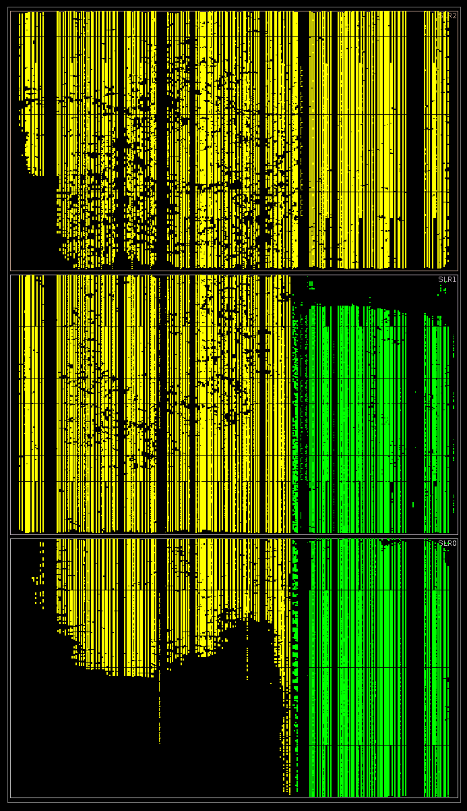
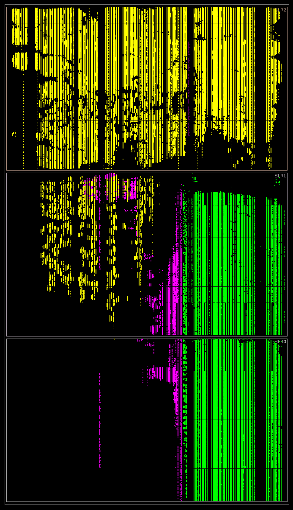

# VDF Alliance FPGA Competition – Round 2

### December 31, 2019

## Team Name
Geriatric Guys with Gates

## Team Members
* Kurt Baty
* Steve Golson

## Round 2 Results

Signoff latency reported by Vivado = 25.548 ns = 39.141 MHz

The latency reported by F1 is slower at 26.4 ns/sq (see our discussion of this discrepancy below):

```
# time ./host -s 0x2 -f 1073741824
Modulus is 124066695684124741398798927404814432744698427125735684128131855064976895337309138910015071214657674309443149407457493434579063840841220334555160125016331040933690674569571217337630239191517205721310197608387239846364360850220896772964978569683229449266819903414117058030106528073928633017118689826625594484331

xclProbe found 1 FPGA slots with xocl driver running
Found Platform
Platform Name: Xilinx
XCLBIN File Name: vdf
INFO: Importing ./vdf.hw.xilinx_aws-vu9p-f1-04261818_dynamic_5_0.awsxclbin
Loading: './vdf.hw.xilinx_aws-vu9p-f1-04261818_dynamic_5_0.awsxclbin'
This AFI already loaded. Skip reload!
Successfully skipped reloading of local image.
AFI load complete.
msu_in is 0x200000000400000000000000000000000
msu_out is 0x3d7a2b7964772eca61b9e890b26c51503c966157764b08093f96b8f54be6bff1c9696578552821f145e9d43be914c922d2cb1b5e69d4940b4a3cfdff180bb9b653956cccc6c12ede58a112231c7ba069470f5b4e65842821150e2cab0a00507925e83a4af2a5ebf640d8167ba11e344f0bb1b3f2ed9134444946552b33a821bd66d8268000000003fffffff
sq_out is 0xdee5ef8828d3af4defb990501e275a441039fb821a9ca6ea9d2e5f39c101164087b764bc11a51e51259f4e558dd946e4e468ad283ec2a2994a1286c73aebca443ace54e6d8ab805aaa6dd32e22dace69411ea7c2d9f98bc0ce3bffd83c06f4acd50d56d80626ef91e8af8e476d1827361f7c8243816cce0dcdcbd883fb7e735

1073741824 26.4 ns/sq: 9782776834334634490446343758704728706980122657033141222406929631982781114105293252444979173994924549755313289718816652420124314107449156688222852673024696927113240716169907514261823484008194829047317452425855361884165852504086556390349991640188347831084926001670580437428161157316196941905575574310934275893

real    0m29.360s
user    0m0.017s
sys     0m0.918s


# time ./host -s 0x2 -f 8589934592
Modulus is 124066695684124741398798927404814432744698427125735684128131855064976895337309138910015071214657674309443149407457493434579063840841220334555160125016331040933690674569571217337630239191517205721310197608387239846364360850220896772964978569683229449266819903414117058030106528073928633017118689826625594484331

xclProbe found 1 FPGA slots with xocl driver running
Found Platform
Platform Name: Xilinx
XCLBIN File Name: vdf
INFO: Importing ./vdf.hw.xilinx_aws-vu9p-f1-04261818_dynamic_5_0.awsxclbin
Loading: './vdf.hw.xilinx_aws-vu9p-f1-04261818_dynamic_5_0.awsxclbin'
This AFI already loaded. Skip reload!
Successfully skipped reloading of local image.
AFI load complete.
msu_in is 0x200000002000000000000000000000000
msu_out is 0x37c7eca35e4ca314eed7806ca27378b3a089f848cfe23c30969f1d11bf9429621848b552ecb210e6153d4a8b1e9740da50503a12c167e4231d306a6b8a673a1a7f1820f54ff79a32d9fe03062b3f3dba638c4b344b84ec652a884f95f71a3c2318ca8849beb8f9c37ee667bf8896c4c422be2ce220f35d1fb2cd21fabf1b42481b55d6600000001ffffffff
sq_out is 0x91c6f8effed5ab1e3d4c3f54b1ac8510dae1473c5c80e4129cd73131945630881003456d5831f8bd87d1c9249307e910f1e6497d0c6522b9a313476a86a584ec2b1a0925f447aa5a6041e12416f9223d24fb70f1af5c8cdb29902ec3e439979573610bf284b13a95631907dc173f0bcae46e26bfe60949f9d32342b9baf55bf6

8589934592 26.4 ns/sq: 102368256386169916359827365612800571792365666301971312977995942354617846025386596143391712431433358166688211010309822125361475467257804936503087482716987502673006764711075137383009101195873723994385994119348575002235023711748852168885234742589374906487480494375925647710743732548371509509281989775853398350838

real    3m47.447s
user    0m0.021s
sys     0m0.932s
```

This is an improvement of 2.2ns over the contest baseline 28.6ns/sq.

## Design Philosophy

We used two guiding principles to enable a fast design:

* Single-cycle operation
* Keep all logic in one die

We didn't quite accomplish either goal, but we came close!

## Design Description

Although we pursued a number of different solutions, this entry was created by making a number of incremental changes to Eric Pearson's excellent Round 1 winning design.

### 1. DSP reduction

Eric's design (and the original Ozturk baseline design) represents the current sqr\_out value as a polynomial of 16-bit coefficients. With one bit of overlap, this requires 17-bit arithmetic, and the Xilinx DSP multiplier is used to implement the 17x17 operations. A total of 66 coefficients is required.

We use 50-bit coefficients, and thus 51-bit arithmetic. The largest unsigned multiplier in the DSP in our Ultrascale+ chip is a 26x17. Our 51-bit operation maps very nicely onto this DSP, because 3x17 = 51 and 2x26 = 52. We developed modules multiply\_51x51 and square\_51 which each use just 6 DSPs. This decreases the number of DSPs from 2,211 to 1,386 reducing input loads and total nets.

A total of 21 50-bit coefficients are required. Note there is no distinction between REDUNDANT and NONREDUNDANT coefficients. The software and AXI interface are updated to properly handle the packing and unpacking.

### 2. Use of BRAMs

Eric's design uses LUTRAM to hold the pre-computed modulus values. We replace 432 bits of lut\_addr width with block RAMs (BRAM) for a total of 696 BRAMs. This reduces the number of lut\_datas that need to be vector summed, and saves 109k LUTs.

### 3. Critical logic in one die

Our square operation takes 21 coefficients in and generates 42 coefficients out. However only the upper half of the coefficients are used as addresses to the modulus table lookup. The lower half go straight to the compressor vector-sum.

We split the design between the top die (SLR2) and the middle die (SLR1) by moving square's bottom 20 coefficients (plus the lower 21 bits of the 21st coefficient) into the middle die, keeping all the rest in the top die. This causes some duplication of DSPs raising the total from 1,386 to 1,527 but drops the DSP count in the top die to 845. It also drops over 20k LUTs out of the top die. The timing of the coefficients in SLR1 is lax enough to allow the required SLL crossings without affecting the critical path timing.

There are separate RTL modules for mid-die and top-die logic, and pblocks are used to control placement.

### 4. 3-to-1 compressor

We designed module adder\_tree\_3\_to\_1 which is only 12.5% larger than Eric's adder\_tree\_2\_to\_1 yet compresses 50% more bits per level. We currently have 173 ACC\_ELEMENTS which requires 8 layers of adder\_tree\_2\_to\_1 but only requires 5 layers of adder\_tree\_3\_to\_1. This change saves a *huge* number of LUTs but is unroutable.
	
A mixed solution of one layer of 3\_to\_1s followed by 6 layers of 2\_to\_1s is routable and saves 96k LUTs in the top die.

### 5. Final adder and register

We designed a final 51-bit mux/full\_adder/flop which implements eight bits in a single CLB. This allows us to remove Eric's sq\_in\_d1 flops and associated mux/LUT, thus creating curr\_sq\_in at the top of the design's critical path.

### 6. Clocking

Our initial goal was to have a single clock used only to capture the sq\_out coefficient values once per iteration. However once we switched to BRAMs we needed an intermediate clock edge to capture the BRAM addresses.

Rather than divide down a faster clock, we use the Xilinx MMCM to generate phase edges at arbitrary points in our main cycle. This lets us tune the edge locations to optimize the critical paths.

Later we discuss the problems we encountered programming the MMCM.

### 7. Bypass registers

Our mostly flow-through design has an enormous number of timing paths. We found that the Vivado router has a very difficult time finding a complete legal routed solution.

To help it out, we add flops to the LUTRAM address inputs. These flops have bypass muxes which are selected by top-level control signals. During synthesis/implementation we use case analysis on these controls to force the bypass muxes such that the placer+router sees the flops, and thus there are many fewer distinct timing paths. After routing is complete, we turn the muxes back to bypass and do a final post-route physical optimization.

### 8. Wrapper and interface

Our wrapper and AXI interface uses fewer pipeline stages. The interface state machine changes the input data very infrequently, and we can take advantage of this with multicycle path specifications. This reduces the timing pressure sufficiently without adding additional flops and nets.

A small number of control signals cross between the kernel clock and our modsqr clock. We make the (mostly true) assumption that these clocks are asynchronous, and synchronize these signals appropriately. All CDC signals are coded as toggles which makes them easier to synchronize.

### 9. Power

Eric's design uses interesting power control logic to slowly ramp up the iteration speed. Our design does not seem to need it, so we removed this logic. Our design runs at full speed all the time.

Vivado reports max power at 42.7W, while F1 reports slightly higher:

```
# fpga-describe-local-image -S 0 -M
Power consumption (Vccint):
   Last measured: 8 watts
   Average: 33 watts
   Max measured: 46 watts
```

### 10. Synthesis and implementation flow

The SDAccel/Vivado flow has a number of changes:

- careful selection of Vivado settings and directives
- custom reports and checkpoints at various stages
- different clock settings during place and route
- overconstrain using clock uncertainty
- inhibit the normal frequency scaling and timing check, and run it later in the flow
- enable and disable bypass registers
- final post-route physical optimization using signoff clock settings

## MMCM programming problems

It is common practice in advanced ASIC (and FPGA) flows to use different constraints for implementation and signoff. This is due to the chaotic behavior of our sophisticated synthesis tools: you can often get the best (fastest) synthesis/place/route results using clocks that are faster (or slower) than the ultimate signoff goal.

We attempted to do that with our flow. The RTL sets up the clock tile MMCM with our signoff clock period of 25.548ns. Then, during certain implementation steps we program the MMCM with different periods and edges (using set_property Tcl commands). Finally before the signoff timing reports are run, we program the MMCM back to the RTL/signoff settings.

Unfortunately our bitstream gets written out with the wrong MMCM settings. We haven't been able to discover exactly when SDAccel reads these settings: during elaboration? synthesis? place? route? If we could get the MMCM to behave as expected, then F1 would report the correct latency of 25.6ns for an improvement of 3.1ns over the baseline.

This is one of several limitations/problems we uncovered with the SDAccel/SDx flow.

## Utilization comparison

|                     |  Total<br />LUT | Total<br />nets | modsqr<br />LUT | modsqr<br />DSP | modsqr<br />CARRY8 | modsqr<br />BRAM | 
|--------------------:|:---------------:|:---------------:|:---------------:|:---------------:|:------------------:|:----------------:|
|Eric Pearson Round 1 |       624,773   |    3,257,865    |     485,860     |      2,211      |        50,225      |        0         |
|GGG Round 2          |       412,891   |    2,564,229    |     254,503     |      1,527      |        29,416      |       696        |

----------------------------------------------------------
### Eric Pearson Round 1 die utilization

This is a plot of the eric-pearson-2 design. Green is SDAccel static region (kernel and device management logic). Yellow is modsqr (including wrapper), AXI logic, and other interface logic. Due to instance renaming in the flow, it is not possible to identify which parts of this yellow logic correspond to just modsqr.



----------------------------------------------------------
### GGG Round 2 die utilization

This is a plot of our submitted design. Green is SDAccel static region (kernel and device management logic). Yellow is modsqr (including wrapper). Magenta is the rest of SDAccel dynamic region (AXI and other interface logic).



## Contributions by Team Members

### Kurt Baty
* Algorithm development
* Xilinx expertise
* Arguing with Vivado

### Steve Golson
* Design and project management
* Flow development for synthesis and implementation
* Clocking and interface design
* Strenuous arguing with Vivado and SDAccel

## Team Photo


Kurt Baty and Steve Golson
